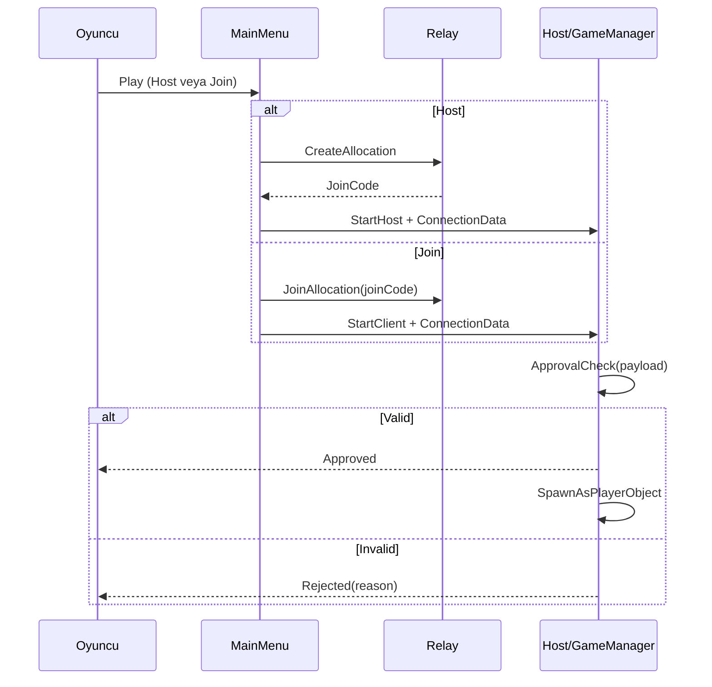

# Aventra Nexus

Unity Netcode for GameObjects + Unity Relay tabanlı, menüden başlayıp oyuna kadar uzanan **listen-host multiplayer** örnek projesi.

> Not: Bu proje "tam mesh P2P" değil, Unity tarafında üretimde en çok kullanılan yaklaşım olan **Host + Clients + Relay** modelini kullanır.

---

## İçindekiler

- [Genel Bakış](#genel-bakış)
- [Öne Çıkan Özellikler](#öne-çıkan-özellikler)
- [Ekran Görselleri](#ekran-görselleri)
- [Mimari](#mimari)
- [Bağlantı Akışı](#bağlantı-akışı)
- [Kurulum](#kurulum)
- [Hızlı Test Senaryosu](#hızlı-test-senaryosu)
- [Klasör Yapısı](#klasör-yapısı)
- [Güvenlik ve Doğrulama](#güvenlik-ve-doğrulama)
- [Sorun Giderme](#sorun-giderme)
- [Yol Haritası](#yol-haritası)
- [Lisans](#lisans)

---

## Genel Bakış

Bu repository, şu soruya odaklanır:

**"Main Menu'de login olan bir oyuncuyu, doğru karakter ve doğrulanmış payload ile multiplayer oyuna nasıl alırız?"**

Akış özeti:

1. Kullanıcı login olur.
2. Main Menu açılır.
3. Oyuncu Host oluşturur veya Join Code ile katılır.
4. Relay üzerinden bağlantı kurulur.
5. Server `ConnectionApproval` ile payload doğrular.
6. Oyuncu server tarafında spawn edilir.

---

## Öne Çıkan Özellikler

- Authentication tabanlı oturum yönetimi
- Main Menu üzerinden Host/Client başlatma
- Relay ile NAT/firewall sorunlarını aşan bağlantı
- `ConnectionPayload` ile karakter/build/token taşıma
- Server-side `ConnectionApproval` ile kabul/red kararı
- Karakter katalog doğrulaması sonrası güvenli spawn

---

## Ekran Görselleri

> Aşağıdaki yollar örnek olarak bırakıldı. Görselleri ekledikten sonra README otomatik gösterir.


---

## Mimari

```mermaid
flowchart LR
        A[Client A / Host] --> B[Unity Relay]
        C[Client B] --> B
        D[Client C] --> B
        A --> E[Server Authority
        (Host process)]
        E --> F[ConnectionApproval]
        F --> G[Spawn + Character Setup]
```

### Neden Listen-Host?

- Küçük/orta ölçekli multiplayer denemeleri için hızlı kurulum
- Ayrı dedicated server maliyeti olmadan oyun başlatma
- Relay ile doğrudan port açma ihtiyacını azaltma

---

## Bağlantı Akışı



### Approval Karar Matrisi

| Kontrol | Sonuç |
|---|---|
| Payload parse edilemiyor | Reddet |
| Build version eşleşmiyor | Reddet |
| Join token geçersiz/boş | Reddet |
| Character ID katalogda yok | Reddet |
| Tüm kontroller başarılı | Kabul et + spawn |

---

## Kurulum

### Gereksinimler

- Unity `6000.0.54f1`
- İnternet bağlantısı (UGS/Relay testleri için)
- Unity Services yapılandırması (Authentication/Relay)

### Adımlar

1. Projeyi Unity Hub ile aç.
2. Package import işlemlerinin bitmesini bekle.
3. UGS projesi bağlantısını doğrula.
4. Sahneyi açıp `NetworkManager` ve `UnityTransport` referanslarını kontrol et.
5. Main Menu'den login olup Host/Join akışını test et.

---

## Hızlı Test Senaryosu

### Senaryo 1 — Host oluşturma

1. Instance A'da login ol.
2. Host başlat.
3. Join code üretildiğini doğrula.

Beklenen: Host tarafı sorunsuz başlar, bağlantı bekler.

### Senaryo 2 — Client katılımı

1. Instance B'de login ol.
2. Join code girerek katıl.
3. Approval sonrası oyuncu spawn kontrolü yap.

Beklenen: Client kabul edilir ve doğru karakterle oyuna girer.

### Senaryo 3 — Geçersiz payload

1. Yanlış build version veya bozuk payload gönder.
2. Red reason logunu doğrula.

Beklenen: Sunucu bağlantıyı reddeder, oyun objesi spawn edilmez.

---

## Klasör Yapısı

```text
Assets/
    _GAME/
        Scripts/
            Multiplayer/
                ConnectionPayload.cs
                P2PSessionService.cs
            UI/
                Menu/
                    MainMenu.cs
                    MultiplayerManagerMenu.cs
            GameManager.cs
Docs/
    UGS_Multiplayer_Ders_Notu.md
```

---

## Güvenlik ve Doğrulama

- Client verisi asla "gerçek kaynak" kabul edilmez.
- `ConnectionApproval` tek karar noktasıdır.
- `joinToken` üretimi örnek seviyededir; production için Cloud Code/backend önerilir.
- Kritik alanlar server tarafında tekrar doğrulanır:
    - `selectedCharacterId`
    - `buildVersion`
    - `playerId` / `joinToken`

---

## Sorun Giderme

### Client bağlanamıyor

- Relay allocation/join çağrılarının başarılı olduğunu kontrol et.
- `ConnectionData` payload'ının boş gitmediğini doğrula.
- Host tarafında `ConnectionApproval` red reason loglarını incele.

### Oyuncu spawn olmuyor

- `response.CreatePlayerObject = false` kullanıyorsan manuel spawn çağrısını doğrula.
- `CharacterCatalog` içinde gönderilen karakter ID'nin mevcut olduğunu kontrol et.

### Sürüm uyuşmazlığı

- Host ve client build version değerlerinin aynı olduğundan emin ol.

---

## Yol Haritası

- [ ] Join token doğrulamasını Cloud Code ile imzalı hale getirmek
- [ ] Lobby entegrasyonu ile oda listesi/keşfi eklemek
- [ ] Host migration stratejisi tasarlamak
- [ ] Disconnect/reconnect UX iyileştirmeleri
- [ ] Multiplayer PlayMode ile otomatik test seti eklemek

---

## Lisans

Bu repository için henüz lisans dosyası yok. GitHub'a açmadan önce `LICENSE` dosyası eklemen önerilir.
